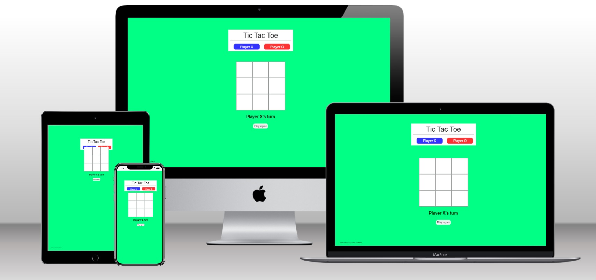
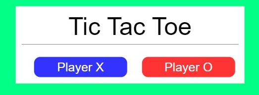
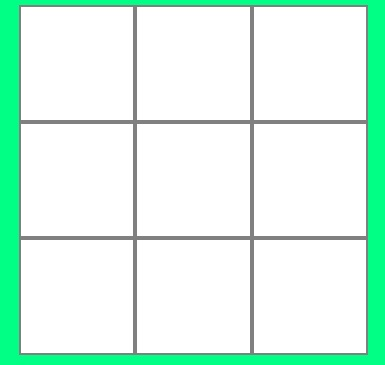
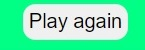
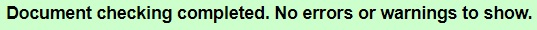
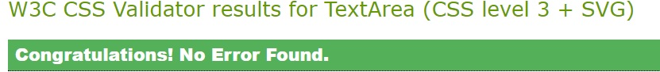
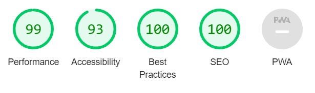

# TicTacToe

# Tic Tac Toe

This website provides a simple game for two human players to play the classic game Tic Tac Toe. Tic Tac Toe is a turn-based game where players take it in turns to lay their game piece in a 3x3 grid with the aim of forming three-in-a-row. The match is won when a player can get three of their own game piece in a row, whether it be horizontally, vertically or diagonally. A match can be drawn if neither player achieves a three-in-a-row before all the areas of the grid have been filled. Then the game can be just restarted and enjoyed all over again!

This game shows the basic functions in HTML, CSS and JavaScript so can be interesting to look at from that perspective - if the game is not interesting enough!

## Features

### Page layout

The website is all focused onto one page so there are no links to any other pages.

There is a Heading Box at the top which displays the name of the game and that there are two players who can play.

In the middle of the page is the playing grid. Is is a 3x3 grid of squares that can be clicked on during the duration of the game. Player 1 will enter X's and Player 2 will enter O's.

There is a text information underneath the playing grid, I have called it the status bar. It shows who's current turn it is and also if the match has been won or drawn.

At the bottom is the Play Again button which will restart the game, clearing the grid of previous game information.

And finally the footer which includes the author of the website.

## Bugs

### Resolved issues

There were a few bugs which have now been remedied:
 - Squares could be clicked on multiple times and that also saw a change of player. What should have happened is that the square once chosen is then blocked from further changes. This issue was solved by ensuring that only empty squares could be clicked on. 
 - The player could continue clicking on empty squares even after the game was finished. Empty squares could still be clicked on and that was stopped by inserting a check to see if the game was over and then if the game was over, the ability to click on an empty box was removed.
  

### Unresolved issues

- Clicking on the "New Game" button did not clear the board and reset addEventListeners as desired but a reload page command was inserted that meant that a new game can start after clicking on "New Game". 

- Layout of game grid is not aligned correctly on the iPad on the MultiDevice picture. Media query settings were not sufficient to correct this. 

## Validator testing

HTML - W3C validator

CSS - official (jigsaw) validator

I have run this page through dev tools Lighthouse function:

## Deployment

The website has been deployed through gitHub and can be found in the following link:
https://welshdan.github.io/TicTacToe/

## Credits

Tips and help:

W3.org - centering of start box / color coding 
JavaScript Master - startGame functions and layout help (https://www.youtube.com/watch?v=Slj9rPBJTcY&t=1214s) 
Emer Heffernan, personal tutoring and help 
Code.mu Winner check function (https://code.mu/en/javascript/book/practice/tick-tack-toe/victory-checking/) 
My mentor Akshat Garg, for his guidance and assistance. 